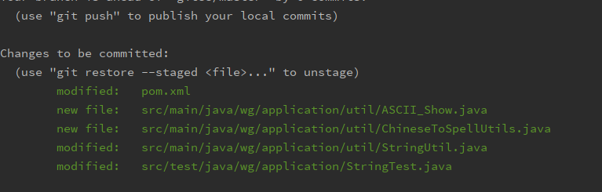
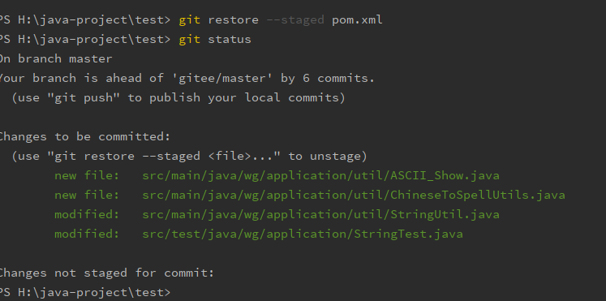

https://github.com/boniu-w/gitskills

### 1. 在新電腦上生成ssh 私钥

列出 所有 .ssh文件

ls -al ~/.ssh  

运行命令

ssh-keygen -t rsa -C "boniu-w@live.cn"  # 按三次回车

## 2. 添加所有更改 或某个更改

git remote add origin https://github.com/boniu-w/gitProject.git       #给git仓库 提供远程地址 关联远程库

git  add .    #添加所有到缓冲区
git add README.md         #只添加README.md文件到缓冲区

git commit -m "first commit"     #为这次提交添加说明

git push -u origin master #向远程库推送代码


## 3. 安装完git后, 进行全局设置

1. 安装完成后 进一步设置
     git config --global user.name "Your Name"
     git config --global user.email "email@example.com"

2. 要关联一个远程库，使用命令

>   git remote add  远程库标识({origin ,server ,gitee})   远程库地址

第一次推送master分支的所有内容；
此后，每次本地提交后，只要有必要，就可以使用命令git push origin master推送最新修改；
分布式版本系统的最大好处之一是在本地工作完全不需要考虑远程库的存在，也就是有没有联网都可以正常
工作，而SVN在没有联网的时候是拒绝干活的！当有网络的时候，再把本地提交推送一下就完成了同步，
真是太方便了！

3. 要克隆一个仓库，首先必须知道仓库的地址，然后使用git clone命令克隆。
   Git支持多种协议，包括https，但通过ssh支持的原生git协议速度最快。

提交一个项目到GitHub
比如在gitskills文件夹下 这是我在GitHub上clone的repository,cd到这个文件夹下,右键打开bash,出现命令
窗口,执行git语句

	> git remote add origin https://github.com/boniu-w/gitProject.git
	>
	> git add README.md
	> git commit -m "first commit"	
	> git push -u origin mastergit

就可以了
git remote add origin https://github.com/boniu-w/gitProject.git 这个命令 在第一次执行过以后 就可以省略掉了 因为 在此文件夹下的.git文件中已保存了 地址
第四条命令中的 -u 也可以省略掉了

4. git log --pretty=online
   查看历史记录
5. 创建分支
     git checkout -b dev
     -b参数表示创建并切换，相当于以下两条命令：
     git branch dev
     git checkout dev
     查看当前分支,git branch命令会列出所有分支，当前分支前面会标一个*号
     
     然后，我们就可以在dev分支上正常提交
     git add test1.txt 
     git commit -m "branch test"
6. 现在切换回master

  git checkout master

  切换回master分支后，再查看一个readme.txt文件，刚才添加的内容不见了！
  因为那个提交是在dev分支上，而master分支此刻的提交点并没有变
  现在，我们把dev分支的工作成果合并到master分支上

  git merge dev

  git merge命令用于合并指定分支到当前分支。合并后，再查看readme.txt的内容，
  就可以看到，和dev分支的最新提交是完全一样的。
  注意到上面的Fast-forward信息，Git告诉我们，这次合并是“快进模式”，也就是
  直接把master指向dev的当前提交，所以合并速度非常快
  当然，也不是每次合并都能Fast-forward，我们后面会讲其他方式的合并。
  合并完成后，就可以放心地删除dev分支了

  git branch -D dev

  删除后，查看branch，就只剩下master分支了：
  git branch
  因为创建、合并和删除分支非常快，所以Git鼓励你使用分支完成某个任务，合并后再删掉分支，
  这和直接在master分支上工作效果是一样的，但过程更安全

7. 小结
   Git鼓励大量使用分支：

查看分支：git branch

创建分支：git branch <name>

切换分支：git checkout <name>

创建+切换分支：git checkout -b <name>

合并某分支到当前分支：git merge <name>  // name: 其他分支名

删除分支：git branch -D <name>

8. 删除库中文件
       git rm 
9. 查看库中文件列表
       git ls-files

#### 代码冲突

#### 如何解决failed to push some refs to git

1. 可以通过如下命令进行代码合并【注：pull=fetch+merge]
   git pull --rebase origin master

   在使用git的过程中经常需要使用到git pull命令，在更新远端代码的同时如果与本地代码产生冲突了，

   那么冲突的文件中就出现了需要手动合并的部分，而git pull --rebase不同的地方则是当有这些冲突存在时，git帮我们自动创建了一个新的分支，并且git告诉你接下来你要在这个新的分支上处理这个冲突，

#### 分支 等

1. 查看本地分支

git branch

2. 查看本地与远程分支

git branch -a

3. 切换分支

git checkout branchName

4. 创建并切换分支

git checkout -b newBranchName

5. 切换分支

git checkout remoteBranchName

6. 删除本地分支

git branch -d branchName

7. 删除远程分支

git push origin -d branchName

#### 版本回退

 一、**撤回尚未提交的修改（工作区 => 暂存区前）**

如果你还没有执行 `git add`，只是改了文件，可以用以下命令撤回：

```
bash


复制编辑
git checkout -- 文件名
```

比如：

```
bash


复制编辑
git checkout -- src/Main.java
```

这个操作会把文件还原成最新一次提交的内容（即 `HEAD` 里的版本），相当于放弃了本地修改。

------

 二、**撤回已 git add 但未提交的修改（暂存区）**

如果你已经用 `git add` 添加到了暂存区，但还没提交，可以这样撤回：

```
bash


复制编辑
git reset HEAD 文件名
```

这会把文件从**暂存区**移回工作区（不影响文件内容），然后你可以再用上面提到的 `git checkout -- 文件名` 放弃工作区的修改。

------

 三、**撤回已经提交的某个文件的修改**

如果你已经提交了，想撤回某个文件，可以用：

```
bash


复制编辑
git checkout 上一个提交ID -- 文件名
```

比如：

```
bash


复制编辑
git checkout HEAD^ -- src/Main.java
```

然后你再用：

```
bash


复制编辑
git commit -am "撤回某个文件"
```

也可以用 `git revert` 或 `git restore`，更现代一点的写法见下面补充。

------

 四、**用 Git 2.23+ 的 git restore（推荐新项目使用）**

```
bash


复制编辑
# 撤回工作区对某文件的修改
git restore 文件名

# 撤回已添加到暂存区的文件
git restore --staged 文件名

# 同时撤回工作区和暂存区的文件
git restore --staged --worktree 文件名
```

------


#### 项目关联多个 库

​	git remote add wg 仓库地址    // wg 对应 原来的origin 
​	

	git remote -v  // 查看项目 关联的所有库
	
	提交时
	git push wg master 

#### git log 之后退出

​	英文状态下按Q

#### git 如果操作失误,错误的使用 git reset --hard 回滚

 使得工作目录改变了,可以使用git reflog,看到相应的快照,可以回滚回去.

```java
git reset --hard 分支名  // 让本地代码与分支代码保持一致
```

#### git 的一个bug

```java
error: RPC failed; curl 18 transfer closed with outstanding read data remaining
fatal: The remote end hung up unexpectedly
fatal: 过早的文件结束符（EOF）
fatal: index-pack 失败
```

解决:

究其原因是因为curl的postBuffer的默认值太小，我们需要调整它的大小，在终端重新配置大小,在这里，把postBuffer的值配置成500M是不够用的,我设成了2G 才好

```java
 git config --global http.postBuffer 524288000
```

这样已经配置好了，如果你不确定，可以根据以下命令查看postBuffer。

   git config --list

---


#### github 下载单个文件夹

```java
git remote add -f origin 仓库地址
git config core.sparseCheckout true
echo "单个文件夹" >> .git/info/sparse-checkout
git pull origin master    
```


#### 查看单个文件的提交历史

```java
  git log  文件名(具体到文件详细路径)
```


#### git中Already up to date 问题

- 这个问题的原因是当前分支的代码与master分支代码不同步

  - 解决方法:

    ```java
    git checkout .  // 放弃本地缓存
    ```

#### 保留本地修改的同时,拉取 合并远程代码

```java
	git stash save "comment 你的一些注释" 
    git pull origin dev_wz
    git stash pop
```

#### git 修改分支名

```java
git branch -m 原名 新名
```

#### git 各种命令解释

1. git stash save "comment 你的一些注释" // 

   - 当正在dev分支上开发某个项目，这时项目中出现一个bug，需要紧急修复，但是正在开发的内容只是完成一半，还不想提交，这时可以用git stash命令将修改的内容保存至堆栈区，然后顺利切换到hotfix分支进行bug修复，修复完成后，再次切回到dev分支，从堆栈中恢复刚刚保存的内容

   - 总的来说，git stash命令的作用就是将目前还不想提交的但是已经修改的内容进行保存至堆栈中，后续可以在某个分支上恢复出堆栈中的内容。这也就是说，stash中的内容不仅仅可以恢复到原先开发的分支，也可以恢复到其他任意指定的分支上。git stash作用的范围包括工作区和暂存区中的内容，也就是说没有提交的内容都会保存至堆栈中。

2. git stash list  // 查看stash了哪些存储

3. git stash pop  // 取出stash的存储到当前的工作目录,并删除其他的stash,默认取第一个stash,即stash@{0}

4. git add .  // 缓存本地代码

5. git commit -m "comment"  // 提交本地代码到本地仓库

6. git commit --amend  // 修改最后一次提交的注释

7. git push origin master  // 推送本地库的代码到远程库

8. git diff  // 此命令比较的是工作目录(Working tree)和暂存区域快照(index)之间的差异

   也就是修改之后还没有暂存起来的变化内容

9. git diff --cached  // 查看本地代码与缓存区代码的不同

10. git diff --staged  // 同上, 查看本地代码与缓存区代码的不同

11. git checkout .  // 放弃本地缓存,也就是add . 之后的东西

12. git fetch  // 将远程库的代码拉取到本地,但还没有融合到本地代码中,用户可以先检查一下拉取的代码是否有要修改的地方,再决定是否要融合;拉取之后 使用 git diff 可以看到不同,然后idea 也会显示冲突的地方,然后修改,之后 add. -> commit -> push

13. git pull // 相当于 git fetch + git merge


#### github 下载 速度 慢

**方法一：**

```js
ping github.com
ping github.global.ss.fastly.net
ping github-cloud.s3.amazonaws.com
```


  **从GitHub下载文件一直非常慢，查看下载链接发现最终被指向了Amazon的服务器，下载地址是http://github-cloud.s3.amazonaws.com/，从国内访问Amazon非常慢，所以总是下载失败，解决方法时更改host文件，使该域名指向香港的服务器：**

**更改hosts文件：**

- Windows

> 更改`C:\Windows\System32\drivers\etc\hosts`文件，在文件中追加`219.76.4.4 github-cloud.s3.amazonaws.com`, 将域名指向该IP即可

- Mac

> 执行 `sudo vi /etc/hosts` 追加 `219.76.4.4 github-cloud.s3.amazonaws.com`


**最后执行**`**ipconfig /flushdns**`**命令，刷新 DNS 缓存。**

**方法二：**

```xml
#github
52.216.128.147 github-cloud.s3.amazonaws.com
140.82.114.4 github.com
199.232.69.194 github.global.ssl.fastly.net
```


​    **https://www.ipaddress.com/ \**使用 IP Lookup 工具获得下面这两个github域名的ip地址，该网站可能需要梯子，输入上述域名后，分别获得github.com和github.global.ssl.fastly.net对应的ip，比如192.30.xx.xx和151.101.xx.xx。准备工作做完之后，打开的hosts文件中添加如下格式，IP修改为自己查询到的IP：\**

\**192.30.xx.xx github.com
151.101.xx.xx github.global.ssl.fastly.net\**

\**\*\*最后执行\*\*`\*\*ipconfig /flushdns\*\*`\*\*命令，刷新 DNS 缓存。\*\*修改后的下载速度能达到 200KB/S 以上。\*\*\*\*\****

 **方法四：**

​    **这个需要开启代理，有些人开启后发现下载速度还是上不去，因为GitHub没被qiang，只是限速了，所以没走代理。需要修改pac.txt文件。在pac里面添加一行规则。后面需要加\*。因为下载的网站不是github.com。而是涉及很多个github\**\**.com 后面忘记了，但是都是github打头的。使用下面的规则github才全部走代理。**

```cpp
  "||github*.com",
```


**方法五：**

   **如果运行了SS（纸飞机）等代理工具，方法四只能用于加速网页浏览下载github仓库项目，但是如果你装了git或者sourcetree等其他git管理工具，使用方法四是无法走代理加速的。你需要设置自己的git才能使用代理。在C:\Users\用户名\.ssh 目录下config文件里，只有使用git生成过ssh密钥的才有此目录，没有config文件则新建一个，注意文件没有后缀。添加如下内容**

```cpp
Host github.com


ProxyCommand connect -H 127.0.0.1:1080 %h %p   #-S为socks


HostName %h


Port 22


User git


IdentityFile  ~/.ssh/id_rsa 


IdentitiesOnly yes
```

**下载connect.exe。放到git安装目录的bin目录下。**

**下载地址：https://download.csdn.net/download/qing666888/11973853**

**再次启动sourcetree进行SSH模式下clone 拉取代码，速度直接就上10M/S了，当然取决于你SSR的速度。**


#### git命令

| <span style="white-space: nowrap; width:30%">命令&emsp;&emsp;&emsp;&emsp;&emsp;&emsp;&emsp;&emsp;&emsp;&emsp;&emsp;&emsp;&emsp;&emsp;&emsp;&emsp;</span> | <span style="white-space: nowrap;"> 解释&emsp;&emsp;&emsp;&emsp;&emsp;&emsp;&emsp;&emsp;&emsp;&emsp;&emsp;&emsp;&emsp;&emsp;&emsp; </span> | <span style="white-space: nowrap;">例子&emsp;&emsp;&emsp;&emsp;&emsp;&emsp;&emsp;&emsp;&emsp;&emsp;&emsp;&emsp;</span> |
| ------------------------------------------------------------ | ------------------------------------------------------------ | ------------------------------------------------------------ |
| git reflog show --date=iso 分支名                            | 查看分支的各种信息,有创建时间,在此分支上有过的操作           | git reflog show  --date=iso dev                              |
| git reflog                                                   | 查看当前分支的操作 日志                                      |                                                              |
| git branch -m 原名 新名                                      | 修改分支名                                                   |                                                              |
| git branch -D 分支名                                         | 删除分支                                                     |                                                              |
| git remote add wg 仓库地址                                   | 关联多个库 wg 对应 原来的origin<br>提交时 git push wg 分支名 | git remote add wg https://github.com/boniu-w/test.git <br> git push wg wg-tianjin |
| git remote -v                                                | 查看项目 关联的所有库                                        |                                                              |
| git remote rm origin                                         | 删除 origin                                                  |                                                              |
| git remote set-url origin newGitUrl                          | 直接修改库地址                                               |                                                              |
| git checkout .                                               | 1.没add 前 放弃本地 所有修改的代码<br />2. add后             |                                                              |
| git checkout <commit-hash>                                   | 切换到特定的版本                                             |                                                              |
| git checkout master                                          | 切换到最新版本                                               |                                                              |
| git checkout 具体文件名                                      | 更新到工作目录, git reset 文件后, 文件并没有立即更新, 有unstaged change after reset 这个信息,  然后使用这个命令, 把文件更新过来 | git reset 版本号 文件名<br />git checkout 文件名             |
| git clean  -f  -d                                            | 删除 unversioned files                                       |                                                              |
| git reset HEAD .                                             | add 后 , 放弃本地修改                                        |                                                              |
| git log 完整文件名<br>git reset 版本号 完整文件              | 回退单个文件, 根据实际经验, 第二种好用                       | git add .<br />git stash<br />git reset 版本号 文件<br />第二种<br />git checkout 版本号 文件名 |
| git log --pretty='%aN' &#124; sort &#124; uniq -c &#124; sort -k1 -n -r | 分组查询所有成员的提交次数                                   |                                                              |
| git log --after="2023-01-01 00:00:00" --before="2023-12-31 23:59:59" --pretty='%aN' &#124; sort &#124; uniq -c &#124; sort -k1 -n -r | 根据时间查询提交次数                                         |                                                              |
| git log --format='%aN' &#124; sort -u &#124; while read name; do echo -en "$name\t"; git log --author="$name" --pretty=tformat: --numstat &#124; awk '{ add += $1; subs += $2; loc += $1 - $2 } END { printf "added lines: %s, removed lines: %s, total lines: %s\n", add, subs, loc }' -; done | 所有人的提交代码量                                           |                                                              |
| git log --format='%aN' --since=2022-06-01 --until=2022-12-27 &#124; sort -u &#124; while read name; do echo -en "$name\t"; git log --author="$name" --pretty=tformat: --numstat &#124; awk '{ add += $1; subs += $2; loc += $1 - $2 } END { printf "added lines: %s, removed lines: %s, total lines: %s\n", add, subs, loc }' -; done | 根据时间查看所有人的提交代码量                               |                                                              |
| git reset --hard 版本号                                      | 回退到指定版本                                               | git reset --hard b863671                                     |
| git commit --amend                                           | 修改最后一次提交的注释,会进入vim编辑器                       |                                                              |
| git commit --no-verify -m "跳过检查提交"                     | 跳过检查提交                                                 |                                                              |
| git rebase -i head~2                                         | 压缩提交<br />修改之前的已经提交的某次注释, 数字2表示是最近的两次提交,  也可以使用 HEAD~~ 两个波浪线的形式<br>1. 你想修改哪条注释 就把哪条注释前面的pick换成edit. 方法就是上面说的编辑方式; s 代表压缩：i---编辑，把pick换成edit---Esc---:wq.<br>2. 然后 如果是 edit:  git commit --amend<br>3. 修改注释, 保存退出后, git rebase --continue<br>4. 其实这个原理我的理解就是先版本回退到你想修改的某次版本，然后修改当前的commit注释，然后再回到本地最新的版本 |                                                              |
| git log  文件名(具体到文件详细路径)                          | 单个文件的提交历史                                           |                                                              |
| git diff 版本号1 版本号2 文件名                              | 比较两个版本之间的差别                                       |                                                              |
| git revert -n 版本号                                         | 反做某个版本, 比如说想反做版本2, 又不影响版本10, 使用git revert -n  版本2, 然后修改 提交, 生成版本11, 但版本10 是不受影响的, 和 git reset --hard 版本号, 是有区别的 |                                                              |
| git show 分支名                                              | 查看分支的 最新一次提交的完整信息                            |                                                              |
| git push origin --delete 分支名                              | 删除远程分支                                                 |                                                              |
| git fetch                                                    | 将本地分支与远程同步                                         |                                                              |
| git pull origin master --allow-unrelated-histories           | Git 会默认拒绝合并没有共同祖先的两棵树。如果您确实需要将两个不相关的 Git 仓库合并到一起，则可以使用`--allow-unrelated-histories`选项来强制执行合并操作 |                                                              |
| git branch -r                                                | 查看远程分支                                                 |                                                              |
| git log --pretty=oneline                                     | 提交历史                                                     |                                                              |
| git config user.name                                         | 查看配置的user.name                                          |                                                              |
| git config user.email                                        | 查看配置的user.email                                         |                                                              |
| git config --global user.name 用户名                         | 全局配置 用户名,  修改时 也用这个命令, 修改当前项目的话 不用加 --global |                                                              |
| git config --global user.email  邮箱名                       | 全局配置邮箱, 修改也用此命令                                 |                                                              |
| git checkout branchName                                      | 切換分支                                                     |                                                              |
| git config --system --list<br />git config --local --list<br />git config --global --list<br />git config --list | 查看配置                                                     |                                                              |
| git merge dev                                                | 融合分支, 先切换到master, 再融合                             |                                                              |
| git config --global credential.helper store                  | 将用户名和密码长期全局地长期地存储在客户端(实际是客户端所在电脑，并非git的任何目录下，也就是说，即使重装git，改密码也存在) |                                                              |
| git config --global credential.helper cache                  | 设置记住密码（默认15分钟）                                   |                                                              |
| git config credential.helper 'cache --timeout=3600'          | 设置记住密码一个小时之后失效                                 |                                                              |
| git log origin/master -n 3                                   | 查看远程库log, 查询远程仓库 log                              | git branch -a<br />git log remotes/gitlab/master             |
| git cherry -v                                                | 查看 已 commit 但 未 push 的                                 |                                                              |
| git log --oneline -3                                         | 查看最近 3次 commit log                                      |                                                              |
| git config --global core.quotepath false                     | 解决 git status 时, 文件乱码的问题                           |                                                              |
| git  add  -f 文件名                                          | 强制提交某文件, 即使此类型文件已被忽略                       |                                                              |
| git  rm -r  --cached  文件名                                 | 从 Git 的缓存中删除要忽略的文件，以便它们不会在以后的提交中被包含。 |                                                              |
| git config --global core.autocrlf true                       | Git可以在你提交时自动地把行结束符CRLF转换成LF，而在签出代码时把LF转换成CRLF。用`core.autocrlf`来打开此项功能， 如果是在Windows系统上，把它设置成`true`（默认配置），这样当签出代码时，LF会被转换成CRLF |                                                              |
| git config --global core.autocrlf input                      | linux                                                        |                                                              |
| git stash                                                    | 暂存当前更改, 不需要 git add                                 |                                                              |
| git stash list                                               | 查看暂存区                                                   |                                                              |
| git stash pop                                                | 恢复暂存, 这会恢复最近暂存的更改并删除对应的 stash（`pop` = 恢复 + 删除）。 |                                                              |
| git stash apply                                              | 如果只想恢复但不删除 stash，可以用这个                       |                                                              |
| git stash apply[pop] stash@{n}                               | 恢复指定的stash, 其中 `n` 是 `git stash list` 中显示的序号（比如 `stash@{1}`） , [pop] 可不写 |                                                              |
| git stash drop stash@{n}                                     | 删除某个 stash                                               |                                                              |
| git stash clear                                              | 删除所有 stash                                               |                                                              |
| git clone -b 分支名  仓库地址                                | clone时关联分支                                              |                                                              |
| git clone --depth {n} clone 地址                             | 浅clone, 适用于:不需要完整的提交历史, 只要当前代码           | {n} 表示只需要最近n次的提交, n=1                             |
| git clone --shallow-since="2024-01-01" <远程仓库URL>         | 仅获取该日期之后的提交历史                                   |                                                              |
| git clone --depth 1 --shallow-branch=dev <远程仓库URL>       | 默认浅克隆会获取默认分支（通常是 main/master），如需指定分支的浅历史，可搭配该参数 |                                                              |
| git fetch --unshallow                                        | 拉取所有完整的历史提交，转换为完整仓库                       |                                                              |


git stash 暂存特定文件

```tex
git stash push -m "保存icda" -- ./ceet-ufps-pl-pia-svc/src/main/java/ceet/ufps/pl/pia/pia/service/HistoryAssessmentSpIcdaService.java \
./ceet-ufps-pl-pia-svc/src/main/java/ceet/ufps/pl/pia/pia/service/impl/HistoryAssessmentSpIcdaServiceImpl.java \
./ceet-ufps-pl-pia-svc/src/main/java/ceet/ufps/pl/pia/pia/controller/HistoryAssessmentSpIcdaController.java
```


# 壹. 各种问题

## 1. git操作出现Unlink of file '......' failed. Should I try again?问题

**解决办法：**

> 解决方案不是简单的选择y或者n,而是关闭IDE，让IDE把这些文件释放掉
>
> 原因是工作目录有某些文件正在被程序使用，这个程序多半是Idea,VS或者eclipse,当然也可能是其他程序


## 2. 误 使用git reset --hard 版本号 之后, 再 git log 发现之后的版本不见了

解决:

- 使用命令, 查看操作日志

> git reflog


```c++
123@DESKTOP-O521OIN MINGW64 /d/ideaprojects/changsha/tientsineye (wg-0811)
$ git reflog
3296c73 (HEAD -> wg-0811) HEAD@{0}: reset: moving to 3296c7373f9eed0952361ce77bfdec0beee20509
57ca8ec HEAD@{1}: reset: moving to HEAD^
920a68e HEAD@{2}: reset: moving to HEAD
920a68e HEAD@{3}: reset: moving to HEAD~3
3296c73 (HEAD -> wg-0811) HEAD@{4}: reset: moving to HEAD
3296c73 (HEAD -> wg-0811) HEAD@{5}: commit: modify: 修改token过期时间为24天, 修改端口号为 13545
090c0eb HEAD@{6}: commit: modify: 版本在单点登录前 ac51aeea8b83a921f3935ee69dab6faf1406fbfc
ac51aee HEAD@{7}: reset: moving to ac51aeea8b83a921f3935ee69dab6faf1406fbfc
335111e HEAD@{8}: reset: moving to 335111e34edaafd283c87b8327ad476a32526033
b53158f (origin/wg-0811) HEAD@{9}: commit: modify: 为了本地化, 修改dev 配置文件, 现在能够正常启动了
67f1260 HEAD@{10}: checkout: moving from master to wg-0811
30fc463 (master) HEAD@{11}: pull origin wg-0811 --allow-unrelated-histories: Merge made by the 'recursive' strategy.
13f4a7e (origin/master, origin/HEAD) HEAD@{12}: clone: from ssh-git.yxkj-tj.com:tcc/tientsineye.git

```


- 使用 git show \<command id> 查看 commit 信息

```c++
123@DESKTOP-O521OIN MINGW64 /d/ideaprojects/changsha/tientsineye (wg-0811)
$ git show 67f1260
commit 67f12604f48252f9e54bed82bc2db8a9f627cdb9
Author: boniu <boniu-w@live.cn>
Date:   Fri Sep 25 17:05:17 2020 +0800

    总体没啥问题了

diff --git a/src/main/java/com/fybdp/tientsineye/controller/LoginController.java b/src/main/java/com/fybdp/tientsineye/controller/LoginController.java
index 682c07a..4136b81 100644
--- a/src/main/java/com/fybdp/tientsineye/controller/LoginController.java
+++ b/src/main/java/com/fybdp/tientsineye/controller/LoginController.java
@@ -97,7 +97,7 @@ public class LoginController {
         }
         if(teuser!=null){
             String realname = teuser.getRealName();
-            String pcname = teuser.getPcNumber();
+            String pcNumber = teuser.getPcNumber();
             String idcard_no = teuser.getIdcard_no();
             String username = teuser.getUserName();
             String depname = teuser.getDeptName();
@@ -110,7 +110,7 @@ public class LoginController {
             authTokenDetails.setPoliceName(idcard_no);
             authTokenDetails.setDeptId(depcode);
             authTokenDetails.setDeptName(depname);
-            authTokenDetails.setOperatorId(userId);
+            authTokenDetails.setOperatorId(pcNumber);

             List<String> aut = new ArrayList<String>();
             aut.add("ADMIN");

123@DESKTOP-O521OIN MINGW64 /d/ideaprojects/changsha/tientsineye (wg-0811)

```


- 再使用git reset --hard <版本号> 到想要的版本位置


## 3. gitee 403

原因: **git 客户端缓存了错误的密码**

先执行:  确认并添加主机SSH到可信列表

```
ssh -T git@gitee.com  
```

再: 

要么 添加ssh公钥后, 使用ssh地址

要么 修改缓存的密码


## 4. type must be one of [feat, fix, perf, style, docs, test, refactor, build, ci, chore, revert, wip, workflow, types, release] [type-enum]

 ```
 feat：新功能（feature）
 fix：修补bug
 docs：文档（documentation）
 style： 格式方面的优化
 refactor：重构
 test：测试
 chore：构建过程或辅助工具的变动
 ```


## 5.  The following untracked working tree files would be overwritten by merge:         .DS_Store

```
git clean -d -fx .DS_Store
```


## 6. fatal: refusing to merge unrelated histories

```
这个错误通常出现在合并两个不相关的 Git 仓库的历史记录时，也有可能是因为在本地仓库中新建了一个分支而没有指定父提交。

Git 会默认拒绝合并没有共同祖先的两棵树。如果您确实需要将两个不相关的 Git 仓库合并到一起，则可以使用--allow-unrelated-histories选项来强制执行合并操作。例如：

git pull origin master --allow-unrelated-histories
请注意，在执行此操作前，请确保您已经备份了所有数据，并牢记这将对您的仓库历史记录产生重大影响。

如果您只是新建了一个本地分支而没有指定父提交，可以在创建分支时指定父提交，例如：

git branch new-branch-name <commit>
其中 <commit> 是指定的父提交的 SHA-1 值或分支名称。
```


# 贰. gitignore


```swift
/mtk/ 过滤整个文件夹
*.zip 过滤所有.zip文件
/mtk/do.c 过滤某个具体文件
```

```swift
!src/   不过滤该文件夹
!*.zip   不过滤所有.zip文件
!/mtk/do.c 不过滤该文件
```

```
/    目录
*    多个字符
?    单个字符
[]    多个可选字符匹配单个字符
!    不忽略(跟踪)匹配到的文件或目录
```


注意 : 

1. .gitignore只能忽略那些原来没有被track（之前没有add过）的文件，如果某些文件已经被纳入了版本管理中，则修改.gitignore是无效的

   解决方案:

```
解决方法就是先把本地缓存删除（改变成未track状态），然后再提交:

git rm -r --cached target
git rm -r --cached .idea
此后不再追踪 target .idea  这两个文件夹

#  The following untracked working tree files would be overwritten by merge:         .DS_Store
git clean -d -fx .DS_Store
```

2. 

# 叁. 合并分支时, 忽略某些文件

1. git config --global merge.ours.driver true
2. 


# 肆. git config

1. ```text
   git config --global core.quotepath false
   ```

   解决 git status 时, 文件乱码的问题

   


# 伍. 除了某个文件外, 其他的都提交, 

1. git add .

   

2. git  restore --staged <file>... 

   

3. git commit -m ""

4. git push

# 陆. git log

1. git log

2. 查看远程仓库log

   ```shell
   git branch -a
   
   git log remotes/gitlab/master
   ```

   

3. 查看分支的各种信息,有创建时间,在此分支上有过的操作

   某分支上的git 操作记录

   ```shell
    git reflog show --date=iso 分支名
   ```

4. 当前分支上 的 git 操作记录

   ```shell
   git reflog
   ```

5. 


# 柒. 删除远程 某次提交的代码

1. 先与远程库一致, 

   ```
   git pull origin master
   ```

2. reset 到某次提交

   ```
   git reset --hard aad3b0b616ffbaa38230c137abdb9c9d403ce4de
   ```

3. 强制 push 到远程库

   ```
   git push gitee master -f
   ```


# 捌. git submodule

1. 新建 .gitmodules 文件

2. 添加内容

   ```
   [submodule "java-study"]
   	path = java-study
   	url = git@gitee.com:boniu-w/java-study.git
   [submodule "oldversion-05242023"]
   	path = oldversion-05242023
   	url = git@gitee.com:boniu-w/test.git
   ```

3. 新建文件夹 oldversion-05242023

4. 按照 .gitmodules文件的内容 clone 项目 git clone git@gitee.com:boniu-w/test.git

5. 删除

   ```
   要删除 Git 仓库中的子模块，可以按照以下步骤操作：
   
   在命令行中进入主仓库目录。
   
   运行以下两个命令分别从 Git 仓库中移除子模块和删除已经存在的子模块文件夹：
   
   git submodule deinit -f [submodule_path] // 会清空 文件夹
   git rm -f [submodule_path] // 删除文件夹
   其中 [submodule_path] 是指要删除的子模块仓库相对于主仓库的路径。如 ./oldversion
   
   提交改动并删除子模块引用：
   
   git commit -m "Remove submodule"
   rm -rf .git/modules/[submodule_path]
   此时，主仓库中的子模块就已经被完全删除了。注意要同时执行上述两个命令，否则 Git 仍然会保留子模块的元数据。
   
   以上是删除 Git 子模块的基本方法，请根据实际情况进行调整和处理。
   ```

   


命令解释

```
git submodule init
git submodule update

在 Git 中，子模块（submodule）是指一个仓库中包含另一个完整的 Git 仓库。当主仓库需要引用其他项目的代码时，就可以使用子模块来实现。

在添加了子模块后，要克隆包含子模块的仓库，需要执行两个命令：`git submodule init` 和 `git submodule update`，它们的作用分别是：

`git submodule init` 该命令用于初始化仓库中的子模块。它会根据当前 `.gitmodules` 文件中的信息，在本地文件系统上创建对应的子模块目录，并在本地 Git 数据库中记录子模块的 SHA-1 值。

`git submodule update` 该命令首先更新子模块配置信息，然后尝试从远程仓库拉取最新的代码。如果没有指定要更新哪个子模块，则会默认更新所有子模块。这个命令也会自动切换到子模块所属的分支。

需要注意的是，如果子模块在远程仓库发生了更新，需要使用 `git submodule update` 命令来同步更新本地子模块。同时，还需要及时将子模块的变更提交到其所属的仓库，才能保证该子模块在主仓库中工作。

以上是 `git submodule init` 和 `git submodule update` 命令的基本说明。在实际使用中，请根据具体情况进行调整和处理。
```


# 玖. 在master分支上, 融合wg分支时, 指定只融合wg分支上的 ga.txt 文件


```
git checkout master

git checkout wg -- ga.txt

git commit -m "
```


# 拾. git config --global core.autocrlf

`git config --global core.autocrlf` 是 Git 中的一个全局配置选项，用于控制如何处理文本文件中的行结束符（Line endings）。在不同的操作系统中，文本文件的行尾有不同的表示方式：

- **Unix/Linux** 使用 LF（Line Feed，`\n`）作为行结束符。
- **Windows** 使用 CRLF（Carriage Return + Line Feed，`\r\n`）作为行结束符。

`core.autocrlf` 设置有三个主要的可能值：

1. `true`：
   - 当设置为 `true` 时，Git 在提交（commit）时会将所有的文本文件转换为使用 LF 作为行结束符。
   - 在检出（checkout）或克隆（clone）项目时，Git 会将所有文本文件转换为使用 CRLF 行结束符，以适应 Windows 系统。
   - 这个设置对于跨平台协作且大部分开发人员使用 Windows 操作系统的项目较为有用，因为它确保了在版本库中存储的是统一的 LF 结束符，同时在每个人的本地环境中显示为适合操作系统的行结束符。
2. `input`：
   - 设置为 `input` 时，Git 在提交时依然会将 CRLF 转换为 LF 存储在版本库中。
   - 但在检出文件时，Git 不会自动将 LF 转换为 CRLF，而是保持文件原有的 LF 结束符不变。
   - 这种设置适用于跨平台项目，并且期望开发者各自处理自己的文本编辑器或构建工具来正确显示行结束符，或者系统已经配置成能够正确显示 LF 结束符的情况。
3. `false`：
   - 设置为 `false` 时，Git 不进行任何自动的行结束符转换。
   - 提交和检出时，文件内容完全按原样对待，这意味着如果你在 Windows 上创建了一个包含 CRLF 的文件并提交，那么其他用户在检出时也会得到 CRLF。
   - 如果团队成员都是在同一平台上工作，或者所有文件都遵循统一的行结束符规范，这个设置可以避免不必要的转换。

总结起来，对于跨平台开发，推荐大多数开发者使用 `core.autocrlf=input`，这样既可以保证仓库中的文件具有标准的 LF 结束符，又不会在检出时自动转换成 CRLF，除非开发者的环境需要这样做。如果只在一个平台上工作，且不需要自动转换，可以设置为 `false`。


# 11. rebase

在使用 `git pull --rebase` 时，`rebase` 选项的作用是用变基（rebase）的方式来合并远程分支的更新，而不是直接使用默认的合并（merge）。这有助于保持项目历史记录的线性，使得查看和理解历史记录更加容易。

### 什么是 `git pull`？

`git pull` 命令从远程仓库获取最新的更改并将这些更改合并到当前分支。默认情况下，`git pull` 会执行一个合并操作（merge），这可能会导致非线性的提交历史，尤其是在多个开发人员并行工作的情况下。

### 什么是 `rebase`？

`git rebase` 是 Git 中的一个命令，用于将一组提交“移动”到另一个基础提交之上。通过变基操作，可以使提交历史更加线性。它的作用类似于将一系列提交重新应用到一个新的基础提交上。

### `git pull --rebase` 的作用

`git pull --rebase` 是一种从远程分支获取更新并将本地未推送的提交应用到这些更新之上的方法。具体来说，它的作用包括：

1. **获取最新的远程分支更新**： 从远程仓库获取最新的更改。
2. **将本地提交暂存到一个临时区域**： 将本地未推送的提交从当前分支上“移除”，放到一个临时区域。
3. **将远程分支的更新合并到当前分支**： 将获取到的远程分支的更改合并到当前分支上。
4. **重新应用本地提交**： 将暂存的本地提交逐个应用到合并后的最新分支上。

这样做的好处是避免了创建多余的合并提交，从而保持提交历史的线性结构。

### 使用示例

假设你在 `feature` 分支上进行开发，远程仓库的 `master` 分支有新的更新。你可以使用以下命令来同步你的 `feature` 分支：

```
sh
复制代码
git checkout feature
git pull --rebase origin master
```

这将执行以下步骤：

1. 获取远程 `master` 分支的最新更新。
2. 将 `feature` 分支上的本地提交暂存到一个临时区域。
3. 将远程 `master` 分支的更新合并到本地 `feature` 分支。
4. 将本地 `feature` 分支的提交重新应用到更新后的 `feature` 分支之上。

### 详细步骤示例

假设远程仓库有如下提交历史：

```
css
复制代码
A -- B -- C (origin/master)
```

你的本地分支有如下提交历史：

```
mathematica
复制代码
A -- B -- C (origin/master)
      \
       D -- E (feature)
```

当你运行 `git pull --rebase origin master` 时，会执行以下操作：

1. 获取远程 `master` 分支的更新。
2. 将 `D` 和 `E` 提交暂存。
3. 将 `C` 合并到本地 `feature` 分支。
4. 将 `D` 和 `E` 重新应用到 `C` 之后。

最终的提交历史将变为：

```
mathematica
复制代码
A -- B -- C (origin/master)
             \
              D' -- E' (feature)
```

其中 `D'` 和 `E'` 是 `D` 和 `E` 的重新应用版本。

### 注意事项

1. **冲突处理**： 在变基过程中，如果发生冲突，Git 会暂停变基操作，让你手动解决冲突。解决冲突后，需要运行 `git rebase --continue` 继续变基。
2. **避免在公共分支上变基**： 变基会重写提交历史，因此最好在自己的分支上使用变基操作，而不要在公共分支（如 `master` 分支）上使用，以免影响其他开发者。

### 总结

`git pull --rebase` 是一种保持提交历史线性的方法，通过获取远程分支的更新并将本地提交重新应用到更新之上，可以避免产生多余的合并提交，使得历史记录更加清晰易读。在多人协作的项目中，这种方法尤为有用


个人理解: 是执行了 git stash, git stash pop


# 12. git  已提交的历史中,  有两个连续的提交时一样的, 能把他俩融合成一次提交吗

可以通过 Git 的交互式变基（interactive rebase）来融合两个连续的提交。以下是具体步骤：

1. **查看提交历史**： 使用 `git log` 命令查看最近的提交记录，找到你想要融合的两个提交的哈希值或是它们的位置。

2. **启动交互式变基**： 运行以下命令，假设要修改的是最近的两个提交：

   ```
   bash
   
   
   复制代码
   git rebase -i HEAD~2
   ```

3. **编辑提交记录**： 在打开的文本编辑器中，会看到类似这样的内容：

   ```
   php
   
   
   复制代码
   pick <commit1_hash> 提交信息
   pick <commit2_hash> 提交信息
   ```

   将第二个提交的 `pick` 修改为 `squash` 或者简写为 `s`，像这样：

   ```
   php
   
   
   复制代码
   pick <commit1_hash> 提交信息
   squash <commit2_hash> 提交信息
   ```

4. **保存并关闭编辑器**： 保存文件并退出编辑器，Git 会将两个提交融合为一个提交。

5. **编辑合并提交的信息**： 之后会打开另一个编辑器窗口，让你编辑新的提交信息，保存后退出。

6. **完成变基**： 如果没有冲突，变基将会完成，两个提交就会被合并成一个。

7. **推送更改**（如果需要）： 如果你已经推送了原来的提交到远程仓库，可能需要强制推送：

   ```
   bash
   
   
   复制代码
   git push origin <branch_name> --force
   ```

注意：强制推送可能会影响其他协作者的工作，请谨慎操作


# 13. git 我想 查看过去某次提交的 内容, 之后 确认无误后, 将当前内容强行改为 过去的某此提交, 不确认的话, 回到当前状态

```bash
git log
git checkout <commit-hash>
不确认 git checkout 分支名
确认 git reset --hard <commit-hash>
```

